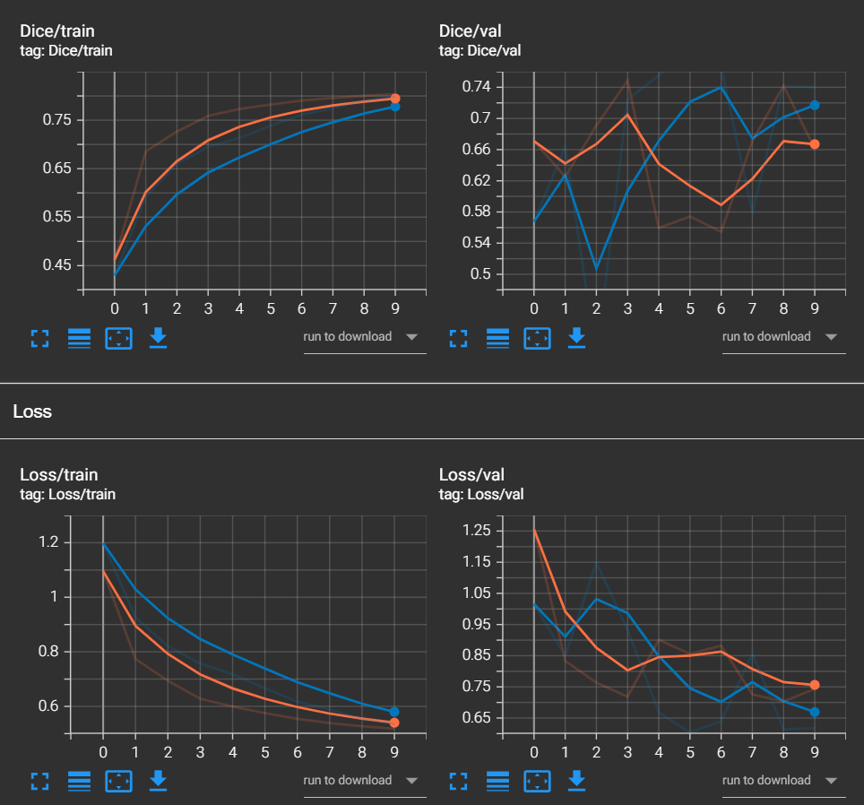
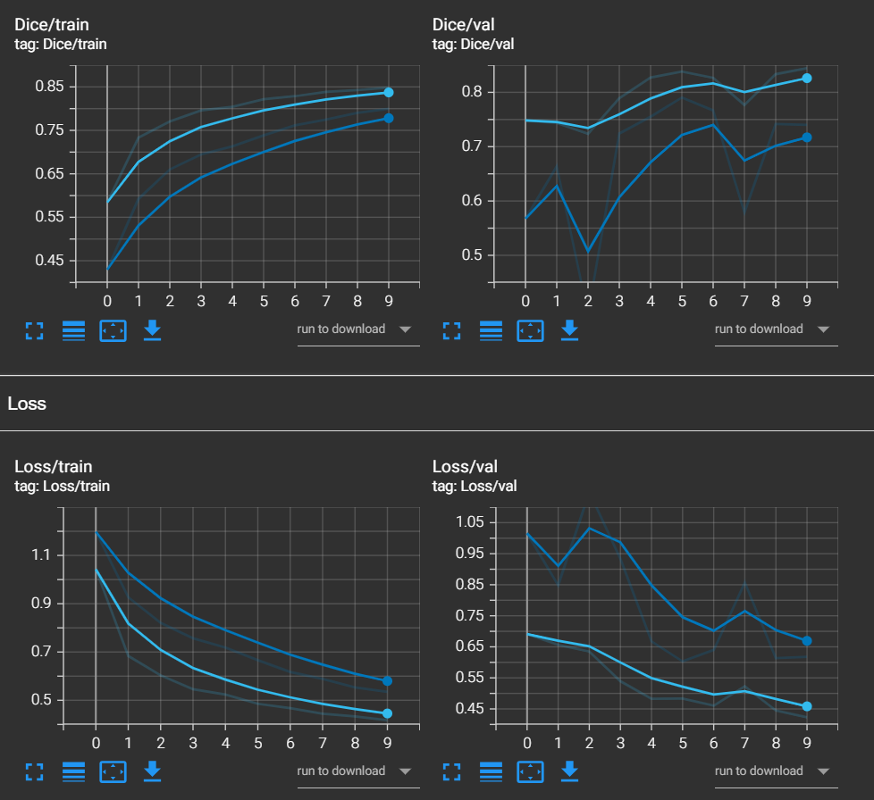
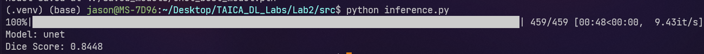

# TAICA Deep Learning Lab 2 Report

## 0. Environment

- CPU: Intel(R) Core(TM) i7-14700
- GPU: NVIDIA GeForce RTX 4090
- OS: Ubuntu 22.04

## 1. Implementation Details (30%)

### Unet
Both Unet model and resnet34+unet model need a convolution block. The convolution block is a combination of two 3x3 convolution layers with ReLU activation function. The convolution block is used in the encoder part of the Unet model and the resnet34+unet model.

The first question of the implementation to UNet is the up-covolution. The paper said that upsampling of the feature map followed by a 2x2 convolution ( up-convolution ) that halves the number of feature channels, a concatenation with the correspondingly cropped feature map from the contracting path, and two 3x3 convolutions, each followed by a ReLU. But it is not clear how to implement the up-convolution. I found that the `nn.ConvTranspose2d` can be used to implement the up-convolution. The `nn.ConvTranspose2d` can upsample the input tensor and then apply a convolution operation. The `nn.ConvTranspose2d` has a parameter `stride` which can be used to control the upsample rate. The `nn.ConvTranspose2d` also has a parameter `output_padding` which can be used to control the output size. The `nn.ConvTranspose2d` can be used to implement the up-convolution in the Unet model.

The original U-Net uses unpadded 3×3 convolutions, causing the output (e.g., 388×388) to be smaller than the input (e.g., 572×572), which mismatches the ground truth size (e.g., 1024×1024) and complicates training. I addressed this by switching to padded convolutions (padding=1), ensuring the output matches the input size (e.g., 1024×1024). This practical modification eliminates preprocessing needs, enhancing U-Net’s usability while preserving its core functionality.

After initial training, I observed suboptimal results, likely due to overfitting and unstable feature learning. To address this, I modified the U-Net by adding Dropout (p=0.1) to the bottleneck layer to regularize the network and reduce overfitting. Additionally, I introduced BatchNorm after each convolution to normalize activations, improving training stability and convergence. These common techniques significantly enhanced the model’s segmentation performance and robustness. The enhancements are mentioned in the paper of Deep Residual Learning for Image Recognition (ResNet), althought the paper said that dropout is not used in the ResNet model, I still use dropout in the bottleneck to prevent overfitting because the dataset is small.

### ResNet34+Unet

### Initialization

For both ResNet and U-Net, I initialized the weights using He initialization, which is mentioned in the paper of [Delving Deep into Rectifiers: Surpassing Human-Level Performance on ImageNet Classification](https://arxiv.org/abs/1502.01852). He initialization is designed for ReLU activation functions, preventing vanishing or exploding gradients and improving convergence speed and performance. I used the default initialization in PyTorch, which implements He initialization for ReLU by default, ensuring optimal weight initialization for both models.

### Model Training

I opted for Adam over SGD to leverage its faster convergence and robustness, addressing SGD’s limitations in learning rate tuning and gradient adaptability. The training method in the U-Net paper, designed for multi-class segmentation with weighted cross-entropy, does not align with this assignment’s binary foreground-background separation task evaluated using Dice score. For this two-class problem, combining BCE with Dice Loss is more suitable, as it directly optimizes for overlap metrics like Dice, improving performance over the paper’s approach.
I learned dropout and L2 regularization from [here](https://www.bilibili.com/video/BV1RqXRYDEe2/?share_source=copy_web&vd_source=8eb0208b6e349b456c095c16067fb3af). I use L2 regularization to calculate the loss to prevent overfitting.

Most important enhancements are the use of modern initialization (He) and normalization (BatchNorm), which significantly improve training stability and convergence. These enhancements are not present in the original U-Net, designed for biomedical images, but are common in modern architectures like ResNet. By incorporating these techniques, I adapted U-Net to natural image tasks, enhancing its performance and usability.

## 2. Data Preprocessing (25%)

I resize images and masks to 512×512, applies random affine transformations (translation, scaling, rotation) with 50% probability, normalizes the image, and converts both to PyTorch tensors, ensuring synchronized geometric changes for segmentation tasks.

My preprocessing pipeline extends U-Net’s elastic deformation with additional augmentations and modern RGB handling (fixed 512×512 size, normalization), suited for natural image tasks. U-Net, designed for biomedical images, uses simpler augmentation and lacks explicit normalization or tensor conversion.

Second, I consider the edges within the images as the foreground class for the segmentation task. Specifically, I process the annotations such that the edge regions—typically representing boundaries between objects and the background—are assigned to the foreground label (value 1). All other regions, including the interior of objects and the background, are treated as the background class (value 0). This binary classification approach focuses the model's attention on accurately delineating edge structures, which are critical for precise segmentation.

In the final experiment of UNet, I find [this webste](https://yanwei-liu.medium.com/pytorch%E8%A8%88%E7%AE%97dataset%E7%9A%84mean%E5%92%8Cstd-ecadb63420ca) before I go into ResNet34+Unet. I calculate the mean and std of the dataset and use them to normalize the dataset instead of using the default mean and std in the albumentations library.


## 3. Analyze the experiment results (25%)

In this lab, I use tensorboard to visualize the training process.

### UNet

I first train the UNet model with the following hyperparameters:

- Batch size: 1
- Learning rate: 0.001
- Weight decay: 0.0002
- Epochs: 10

The training loss and validation loss are shown in the following figure.

The orange line is showing the performance of the one with original initialization, and the blue line is showing the performance of the one with He initialization. The model with He initialization has a lower accuracy at the beginning, but it can converge quickly and achieve a better performance on the validation set after 10 epochs. The model with original initialization has a higher accuracy at the beginning, but it has a little bit overfitting problem.



After adjusting the learning rate to 0.0001, the training loss and validation loss are shown in the following figure.



The light blue line is showing the performance of the one with learning rate 0.0001, and the dark blue line is showing the performance of the one with learning rate 0.001.

After I adjust the learning rate to 0.0001, the model can reach the baseline (Dice score 0.8448) after 10 epochs. The model with learning rate 0.001 can not reach the baseline after 10 epochs.



In the final experiment, I adjust the mean and std of the dataset to normalize the dataset. The idea is from [this webste](https://yanwei-liu.medium.com/pytorch%E8%A8%88%E7%AE%97dataset%E7%9A%84mean%E5%92%8Cstd-ecadb63420ca). The training loss and validation loss are shown in the following figure.

#### Final hyperparameters

- Batch size: 8
- Learning rate: 0.0001
- Weight decay: 0.0002
- Epochs: 10

### ResNet34+Unet

I have the experience of training the UNet model, so I use the same initialization method to train the ResNet34+Unet model. The training loss and validation loss are shown in the following figure.


## 4. Execution steps (0%)

First, go to the `src` directory.

```bash
cd src
```

### Unet

To train the Unet model, run the following command.

```bash
python train.py --model unet --batch_size 8 --lr 0.0001 --weight_decay 0.0002 --epochs 10
```

To test the Unet model, run the following command.

```bash
python inference.py --model unet
```

To train the Resnet34+Unet model, run the following command.

```bash
python train.py --model resnet --batch_size 8 --lr 0.0001 --weight_decay 0.0002 --epochs 10
```

To test the Resnet34+Unet model, run the following command.

```bash
python inference.py --model resnet
```


## 5. Discussion (20%)

### Unet
I find that learning rate for 0.001 and weight decay for 0.0002 is a good choice. The model can converge quickly and the loss is low. The model can achieve a good performance on the validation after 10 epochs with batch size 1.

## 6. Reference

1. 【调教神经网络咋这么难？【白话DeepSeek03】】 https://www.bilibili.com/video/BV1RqXRYDEe2/?share_source=copy_web&vd_source=8eb0208b6e349b456c095c16067fb3af
2. Unet https://arxiv.org/abs/1505.04597
3. ResNet https://arxiv.org/abs/1512.03385
4. Delving Deep into Rectifiers: Surpassing Human-Level Performance on ImageNet Classification https://arxiv.org/abs/1502.01852
5. PyTorch計算dataset的mean和std https://yanwei-liu.medium.com/pytorch%E8%A8%88%E7%AE%97dataset%E7%9A%84mean%E5%92%8Cstd-ecadb63420ca
